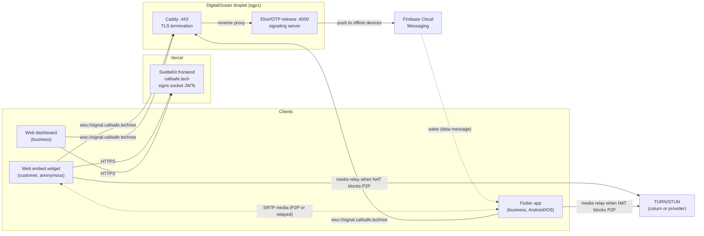
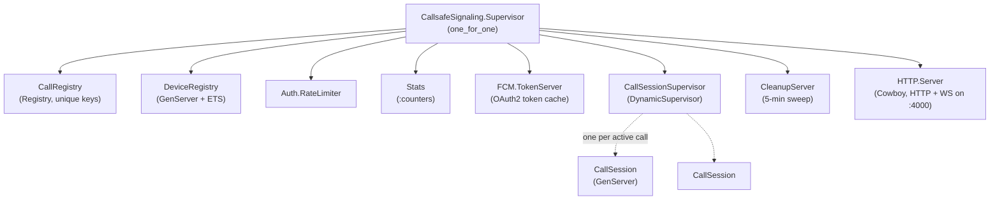
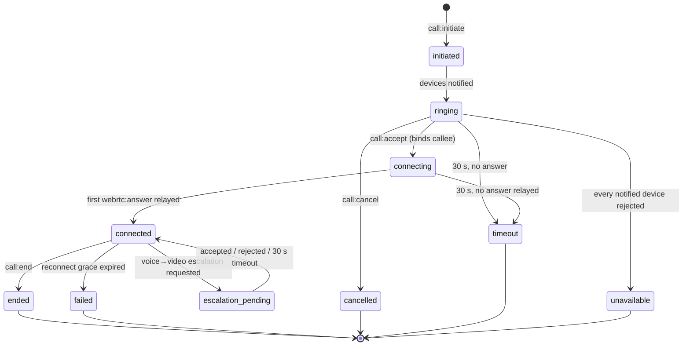

# CallSafe Architecture

CallSafe lets a business's customers start a voice or video call from an
embeddable web widget, and rings the business's phones (Flutter app on
Android/iOS) — including phones where the app has been killed, via an FCM
wake-up. This document describes how the system fits together, what happens
when things fail, and why it's built the way it is.

Companion documents:

- [`protocol/README.md`](protocol/README.md) — the normative wire-protocol
  spec (v2.0.0): message schemas, auth, routing rules, flows.
- [`DEPLOY.md`](DEPLOY.md) — the operational runbook for the signaling server.

## System overview



Three properties shape everything else:

1. **Media never touches the server.** Audio/video flows peer-to-peer over
   WebRTC (or through TURN when NAT forbids P2P). The Elixir server only
   handles signaling — small JSON messages — so a very small box goes a very
   long way.
2. **The server is authoritative for call state.** Clients propose
   transitions (`call:accept`, `call:end`, …); the server validates them
   against a state machine and is the single source of truth for what state a
   call is in. Clients can crash, reconnect, and resync; the call's identity
   survives on the server.
3. **The protocol is generated, not hand-synced.** One JSON file defines
   every message, enum, and state transition for four platforms (see
   [Protocol as single source of truth](#protocol-as-a-single-source-of-truth)).

## The signaling server (Elixir/OTP)

The server (`elixir-signaling-server/`) is a deliberately small OTP
application: raw WebSockets over Cowboy/Plug, no Phoenix, no database. All
state is in-memory process state and ETS.

### Supervision tree

`CallsafeSignaling.Application` starts a `one_for_one` supervisor
([`application.ex`](elixir-signaling-server/lib/callsafe_signaling/application.ex)):



| Process | Role |
|---|---|
| `CallRegistry` | `Registry` with unique keys — looks up a `CallSession` pid by `callAttemptId`. |
| `DeviceRegistry` | ETS-backed presence: O(1) lookup of connected devices by `device_id` and by `business_id` (which devices should ring). |
| `Auth.RateLimiter` | Rate-limits auth attempts and API calls (see [`auth/README.md`](elixir-signaling-server/lib/callsafe_signaling/auth/README.md)). |
| `Stats` | O(1) metrics via `:counters`. |
| `FCM.TokenServer` | Caches the Google OAuth2 bearer token used to call the FCM API. |
| `CallSessionSupervisor` | `DynamicSupervisor` — spawns one `CallSession` process per call attempt. |
| `CleanupServer` | Sweeps terminal sessions every 5 minutes (backstop; see [failure modes](#failure-modes)). |
| `HTTP.Server` | Cowboy listener serving both the HTTP API and the `/ws` WebSocket upgrade. |

**One process per call** is the load-bearing design decision. Each active
call is a GenServer holding its own state and timers. A crash in one call
takes down that call and nothing else; there are no shared locks, and
concurrency scales with the scheduler, not with code we wrote.

### Message routing

Every inbound WebSocket frame passes through `MessageRouter`
([`message_router.ex`](elixir-signaling-server/lib/callsafe_signaling/message_router.ex)),
which enforces — **derived from `protocol.json` metadata, not hand-written
per-message code**:

- schema validation (required fields, types, enum values),
- message direction (client→server vs. both),
- `requiresAuth` (everything except `device:connect` and `ping`),
- sender-role gates (e.g. only a business device may `call:accept`).

Only then is the message dispatched to a domain handler (`CallHandler`,
`WebRTCHandler`, `DeviceHandler`, `MediaHandler`).

### Call lifecycle

A `CallSession`
([`call_session.ex`](elixir-signaling-server/lib/callsafe_signaling/call_session.ex))
is a server-authoritative state machine keyed by `callAttemptId`:



Details worth knowing:

- **Every notified device rings.** `call:incoming` goes to all of the
  business's connected devices (plus FCM pushes to offline ones). The first
  `call:accept` wins and binds that device as the callee; the call only
  becomes `unavailable` when *every* notified device has rejected.
- **The session owns all timers**: ringing (30 s), connecting (30 s),
  escalation (30 s), per-participant reconnect grace (30 s), and terminal
  retention (60 s). Timers are cancelled and rescheduled inside the same
  transition function that changes state, so state and timers can't drift
  apart.
- **Escalation/downgrade**: a connected voice call can request an upgrade to
  video (`escalation_pending`, peer must accept) and a video call can be
  downgraded to voice unilaterally. Whoever's request was granted becomes the
  *renegotiation offerer* — which matters for glare, below.
- **Terminal states are retained for 60 s** before the process stops itself,
  so a late `call:end` from a slow client gets a precise `invalid_state`
  error rather than a confusing `call_not_found`.

### WebRTC relay and the offerer rule

`WebRTCHandler`
([`webrtc_handler.ex`](elixir-signaling-server/lib/callsafe_signaling/webrtc_handler.ex))
relays `webrtc:offer` / `webrtc:answer` / `webrtc:ice-candidate` between the
two participants **verbatim** — SDP payloads are never parsed or reshaped.

WebRTC's classic *glare* problem (both sides sending an offer at once) is
eliminated by construction rather than resolved after the fact:

- during initial negotiation (`connecting`), **only the caller may offer**
  and only the callee may answer;
- during renegotiation (`connected`), **only the granted
  escalation/downgrade requester may offer**.

The server rejects out-of-turn offers with `not_authorized`, so two
well-behaved clients can never collide. Relaying the first answer is also
what transitions the call to `connected`.

### Presence and the FCM wake-up flow

`DeviceRegistry` tracks connected sockets. For business devices that are
*not* connected (app killed, phone in Doze), the server falls back to a push
notification
([`fcm/push_service.ex`](elixir-signaling-server/lib/callsafe_signaling/fcm/push_service.ex)):

```mermaid
sequenceDiagram
    participant Cust as Customer (web embed)
    participant Srv as Signaling server
    participant FCM as Firebase Cloud Messaging
    participant And as Android (app killed)

    Cust->>Srv: call:initiate
    Srv->>Srv: spawn CallSession, notify connected devices
    Srv->>FCM: data-only message, priority=high<br/>{callAttemptId, sourceId, callType}
    FCM->>And: onMessageReceived (app process woken)
    And->>And: full-screen intent notification<br/>(rings like a native call)
    And->>Srv: device:connect (JWT auth)
    Srv->>And: call:incoming (re-delivered)
    And->>Srv: call:accept
    Srv->>Cust: call:accepted → WebRTC negotiation begins
```

Two non-obvious constraints, both encoded in the code:

- The push must be **data-only**: if the payload contained a `notification`
  block, Android would route a backgrounded message to the system tray
  instead of `onMessageReceived`, and the wake → connect → re-delivered
  `call:incoming` chain would never run.
- It must be **`priority: high`**, or Doze delays delivery past the 30-second
  ring timeout.

On the device,
[`CallSafeFirebaseMessagingService.kt`](flutter/android/app/src/main/kotlin/com/callsafe/mobile/fcm/CallSafeFirebaseMessagingService.kt)
caches the pending call and posts a **full-screen intent** notification
(`setFullScreenIntent(..., true)`) so an incoming call lights up the screen
like a native phone call even from a cold start. In-call audio and lifecycle
are handled by a foreground service (`call/CallForegroundService.kt`).

### NAT traversal (TURN)

Clients fetch ICE server credentials from the signaling server before
negotiating. Credentials are ephemeral (24 h TTL), per the coturn
REST-credential scheme
([`turn/credentials.ex`](elixir-signaling-server/lib/callsafe_signaling/turn/credentials.ex)):

- username is `"<expiry-unixtime>:<user>"`,
- credential is `Base64(HMAC-SHA256(shared_secret, username))`,
- the shared secret **never leaves the server** — clients only ever see the
  derived, expiring pair.

Configuration precedence: static provider credentials (e.g. Metered) →
coturn HMAC shared-secret → no TURN (STUN-only fallback). Two endpoints serve
the same generator: a public one for anonymous embed guests
(`GET /api/turn-credentials`) and an authenticated one for the app
(`POST /api/v1/turn/credentials`).

### Authentication

- **Socket auth**: JWT (HS256) carried in the `token` field of
  `device:connect`. The token's `device_id` claim must equal the `deviceId`
  the client claims to be — a mismatch fails with `device_mismatch`, so a
  leaked token can't be replayed as a different device.
- Tokens are **signed by the SvelteKit frontend** (Vercel) and verified by
  the signaling server; the two share `JWT_SECRET`. The server itself never
  issues tokens — identity is the frontend's job, admission is the server's.
- Anonymous embed guests get short-lived guest tokens from the frontend, so
  even "anonymous" sockets are authenticated and rate-limited.

Details, including rate-limiting: [`auth/README.md`](elixir-signaling-server/lib/callsafe_signaling/auth/README.md).

## Failure modes

What actually happens when things break — and what is deliberately *not*
survived.

**A participant's socket drops mid-call.** The `CallSession` monitors both
participant sockets (`Process.monitor`). On `:DOWN` during
`connecting`/`connected`/`escalation_pending` (or the caller during
`ringing`), the session holds the call open for a **30-second reconnect
grace period**. The client reconnects, re-authenticates, and sends
`call:reconnect`; the session re-binds the new socket pid, cancels the grace
timer, and the call continues — WebRTC media often never even dropped, since
it flows peer-to-peer. If the grace period expires, the call transitions to
`failed (peer_disconnected)` and the surviving peer is told. If the *caller*
vanishes while devices are still ringing, every ringing device gets
`call:cancelled` so phones stop ringing.

**A call session crashes.** That one call dies; the `DynamicSupervisor`
isolates the blast radius and no other call or connection is affected.
Clients on that call hit `call_not_found` on their next message and clean up.

**The node dies or restarts.** All call state is in-memory by design, so
in-flight *signaling* state is lost — but established calls keep talking,
because media is peer-to-peer and doesn't traverse the server. systemd
restarts the release (`Restart=always`, ~seconds), clients auto-reconnect
and re-authenticate, and new calls proceed. The accepted trade-off: a call
that was mid-*setup* during the restart fails and must be redialed. See
[single node, by choice](#single-node-by-choice) below.

**Sessions leak.** Two independent mechanisms prevent unbounded growth: each
session schedules its own `auto_stop` 60 s after reaching a terminal state,
and `CleanupServer` sweeps every 5 minutes for terminal sessions the first
mechanism missed (e.g. the timer message was lost to a crash-and-restart of
the session process).

**FCM is down or unconfigured.** Push delivery fails soft: connected devices
still ring over their sockets; only wake-up of killed apps is lost. The
OAuth2 token is cached in `FCM.TokenServer` and refreshed on expiry, so an
FCM auth hiccup doesn't sit in the hot path of every call.

**A client goes silent without closing.** Heartbeat is application-level:
clients ping every 25 s and the server closes any connection idle for 60 s,
which triggers the same monitor/`:DOWN` path as a clean disconnect — so
half-open TCP connections can't hold calls hostage.

**Clients misbehave.** Every message is schema-validated against
`protocol.json` before any handler runs; out-of-turn offers, wrong-role
messages, and transitions the state machine forbids all get typed errors
(`invalid_state`, `not_authorized`, `not_notified`, …) rather than
undefined behavior.

## Design decisions and trade-offs

### Raw WebSockets instead of Phoenix Channels

Phoenix Channels would have given topics, presence, and reconnection
semantics for free — but also a second, framework-specific protocol layered
under the call protocol, and a heavyweight dependency for a server that
serves exactly one WebSocket route. Because the wire protocol must be
implemented natively on four platforms (TypeScript, Dart, Kotlin, Swift),
"just JSON over a raw WebSocket" keeps every client trivial and keeps the
protocol spec the *only* contract. The server is plain Cowboy + Plug; the
entire transport layer is one WebSocket handler.

### Single node, by choice

The server runs as one Elixir node. Distributed Erlang, Horde-style process
handoff, or an external session store would let signaling state survive node
loss — and each was deliberately deferred. The reasoning:

- signaling is tiny (the node isn't resource-bound; media never touches it),
- the failure window only affects calls *being set up* at the moment of a
  restart — established calls continue peer-to-peer,
- systemd restart plus client auto-reconnect bounds the outage to seconds,
- clustering would add a distributed-consistency problem (which node owns a
  `callAttemptId`?) to a product that doesn't yet have the traffic to
  justify it.

The escape hatch is already shaped: sessions are registered by
`callAttemptId` in a `Registry`, so moving to a distributed registry is a
targeted change, not a rewrite.

### Server-authoritative state

Clients never decide what state a call is in; they request transitions and
render what the server tells them. This costs a round-trip on some UI
transitions, but it makes multi-device ringing coherent (one accept wins,
everywhere), makes reconnect resync trivial (ask the server), and turns
client bugs into rejected messages instead of corrupted calls.

### Protocol as a single source of truth

[`protocol/protocol.json`](protocol/protocol.json) defines every message
schema, enum, error code, timeout, and legal state transition. Code
generators emit TypeScript, Kotlin, Dart, and Swift bindings; the Elixir
server reads the JSON **at compile time** for its validator, router
metadata, and state-machine tables. A protocol change is one edit + one
`npm run generate` — four platforms cannot drift, because none of them
hand-writes the contract. The trade-off is generator upkeep, which has paid
for itself many times over across the v1→v2 migration.

## The other components

- **`frontend/`** — SvelteKit app on Vercel: marketing site, business
  dashboard, and the embeddable widget (a tiny loader stub that lazy-loads
  the call core, so embedding costs a host page almost nothing). Also the
  identity provider: it signs the socket JWTs and issues guest tokens.
- **`flutter/`** — the business-side mobile app. Dart owns signaling and call
  state; platform channels bridge to native Kotlin for WebRTC, audio
  routing, FCM, and the foreground call service.
- **`protocol/`** — the spec and its generators. Start at
  [`protocol/README.md`](protocol/README.md).

## Deployment

One DigitalOcean droplet (`sgp1`) runs Caddy (TLS via Let's Encrypt) in
front of the Elixir release, supervised by systemd. The frontend deploys to
Vercel. Full runbook — provisioning, release builds, secrets handling,
gotchas (OTP TLS bug, WebSocket-over-HTTP/2, DNS caching) — in
[`DEPLOY.md`](DEPLOY.md).
