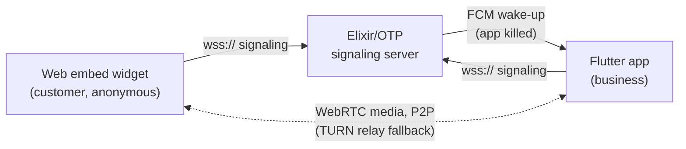

# CallSafe

**Voice & video calling for businesses — a customer clicks a widget on your
website, and your phone rings like a real call, even if the app was killed.**

Deployed and operating at [callsafe.tech](https://callsafe.tech) (beta).
Built and operated by a solo developer: an Elixir/OTP signaling server, a
Flutter mobile app, a SvelteKit frontend with an embeddable widget, and a
code-generated wire protocol shared across four platforms.

<!-- TODO: 60–90s demo video goes here.
     Suggested shots: (1) visitor clicks the embed widget on a website,
     (2) a *killed* Android app wakes via FCM and rings full-screen like a
     native call, (3) answer → live video call between browser and phone,
     (4) mid-call: kill the phone's Wi-Fi, watch the call survive reconnect. -->

## How it works

The server handles only signaling — media flows peer-to-peer over WebRTC —
so one small node carries the whole product. Full design, including failure
modes and trade-offs: **[ARCHITECTURE.md](ARCHITECTURE.md)**.

## The hard parts

The engineering problems this repo actually solves:

- **Waking a dead app for an incoming call.** Android kills backgrounded
  apps; a ringing phone can't wait. A high-priority, data-only FCM message
  wakes the process, a full-screen intent lights the screen like a native
  call, and the client reconnects and picks up the pending call — all inside
  the 30-second ring window, through Doze.
- **A server-authoritative call state machine.** Every call is one supervised
  Elixir process owning its state and timers (ringing, connecting,
  escalation, reconnect grace). Multi-device ringing, first-accept-wins,
  mid-call socket drops with a reconnect grace period — all resolved in one
  place, so client bugs become rejected messages instead of corrupted calls.
- **Glare-free WebRTC negotiation.** The protocol designates exactly one
  legal offerer at every moment (caller during setup, granted requester
  during escalation/downgrade), so offer collisions are impossible by
  construction rather than resolved after the fact.
- **One protocol, four platforms, zero drift.** A single `protocol.json`
  defines every message, enum, and state transition; generators emit
  TypeScript, Kotlin, Dart, and Swift bindings, and the Elixir server
  consumes the same file at compile time.

## Repo layout

| Directory | What it is |
|---|---|
| [`elixir-signaling-server/`](elixir-signaling-server/) | Elixir/OTP signaling server — raw WebSockets, per-call processes, presence, TURN credentials, FCM push. |
| [`flutter/`](flutter/) | Business-side mobile app (Android/iOS) — Dart signaling + native Kotlin/Swift for WebRTC, audio, FCM wake. |
| [`frontend/`](frontend/) | SvelteKit web app on Vercel — marketing site, dashboard, embeddable call widget, JWT issuance. |
| [`protocol/`](protocol/) | The wire protocol (v2.0.0): `protocol.json` source of truth + TS/Kotlin/Dart/Swift generators. |

## Stack

Elixir 1.19 / OTP 27 (Cowboy + Plug, no Phoenix) · WebRTC · Flutter/Dart
with native Kotlin & Swift · SvelteKit + TypeScript · Firebase Cloud
Messaging · coturn/TURN · Caddy + systemd on DigitalOcean · Vercel.

## Documentation

- [ARCHITECTURE.md](ARCHITECTURE.md) — system design, supervision tree, failure modes, trade-offs
- [protocol/README.md](protocol/README.md) — normative wire-protocol spec (v2.0.0)
- [DEPLOY.md](DEPLOY.md) — operational runbook for the signaling server
- [SECURITY.md](SECURITY.md) — vulnerability reporting
- [CHANGELOG.md](CHANGELOG.md) — notable changes

## License

MIT — see [LICENSE](LICENSE).
